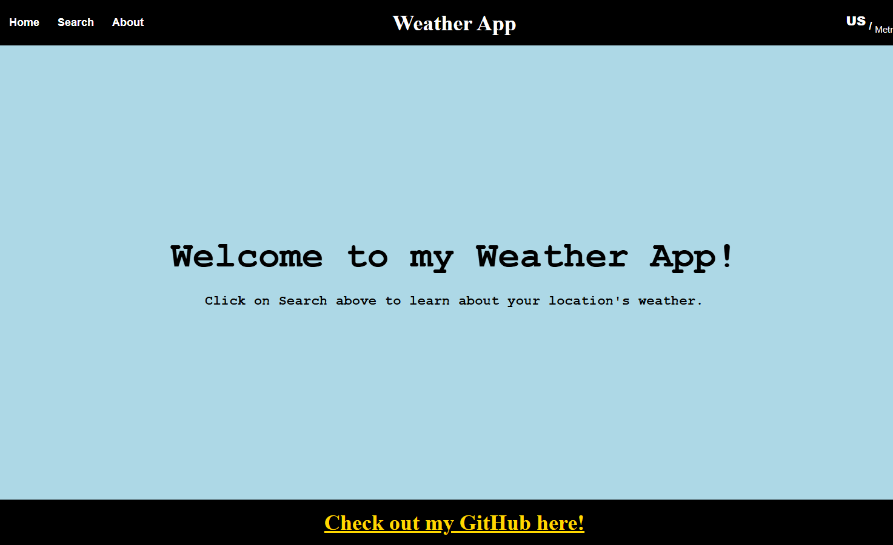
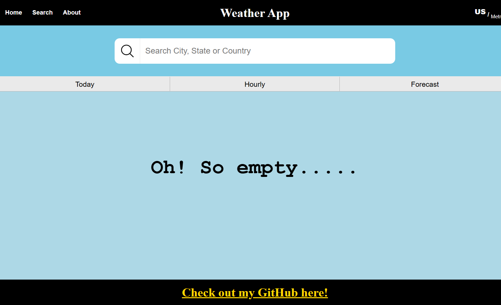
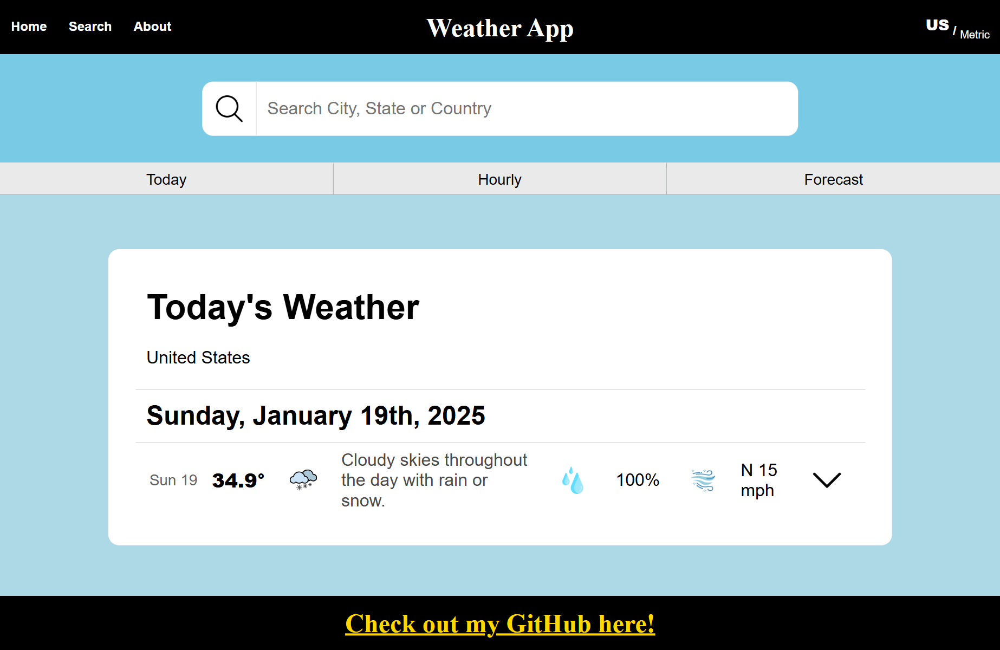
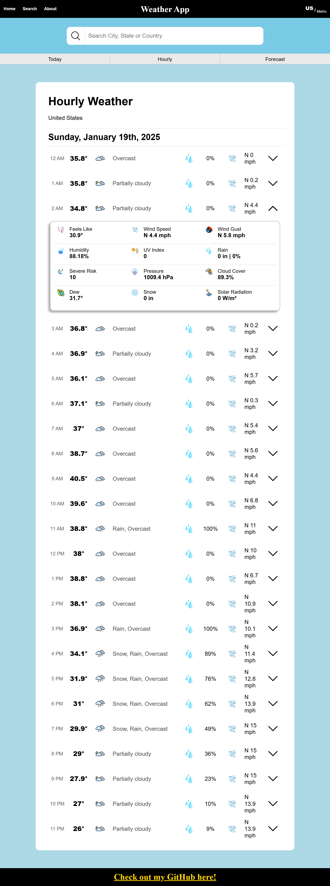
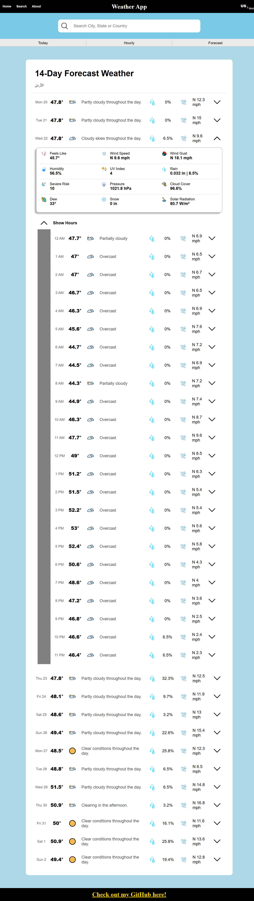
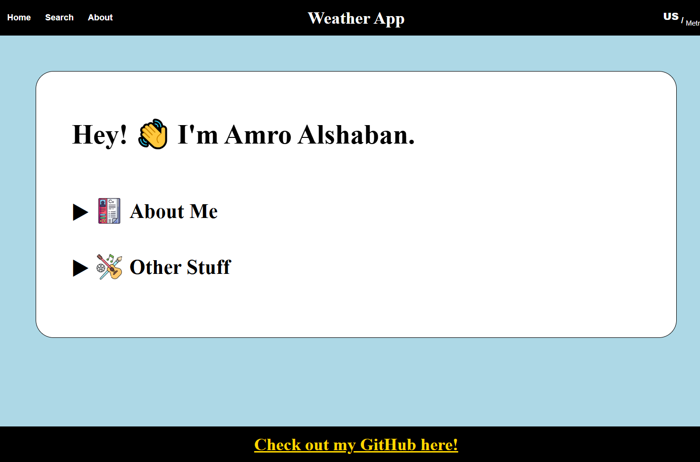
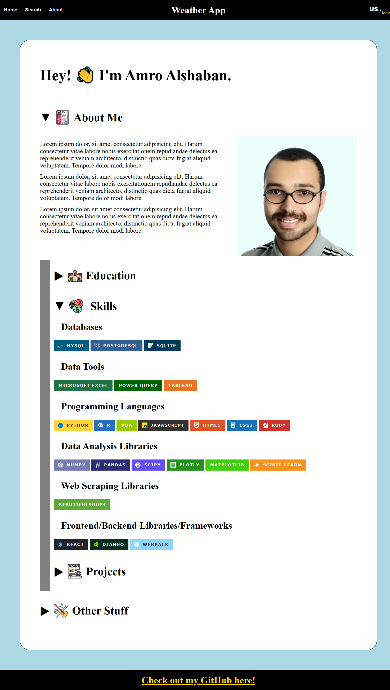

# Weather App

## Demo
Check the demo [here](https://amroalshaban.github.io/odin-weather-app/).

## Screenshots

    
&nbsp; Home

 

---

    
&nbsp; Search

 

    
&nbsp; Search-Empty

 

    
&nbsp; Search-Today

 

    
&nbsp; Search-Hourly

 

    
&nbsp; Search-Forecast

 

---

    
&nbsp; About

 

    
&nbsp; About-Closed

 

    
&nbsp; About-Open

